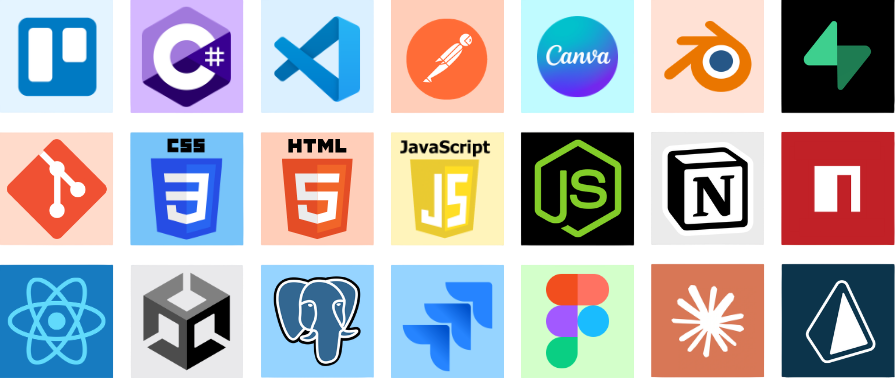

<h1 align="center">
  
</h1>

## 📚 Introduction

I graduated in **Computer Science** at the **University of Debrecen**.

While my primary focus is on **Web Development** with a special love for **Frontend & UI/UX**, I also have a strong interest in **Game Development** and **Software Development**.

I love combining code with creativity, whether it's a website or a 3D environment.

## 🛠️ Languages and Tools

    

## 🚀 Current Project

### Pátyod Klíma Full-Stack Web Application
Developing a dynamic web application to replace the previous static site. My goal is to create a *CMS and business management system* that allows the client to independently manage advertisements, references and internal accounting, as well as automate the sales process.

## ⚡ My Projects

### Echoes of Memory
A *first-person psychological horror* experience developed as a university thesis project in Unity. The game focuses on *atmospheric storytelling*, environmental narrative depth.

🎮 The project is fully playable and hosted on [itch.io](https://levy-games.itch.io/echoes-of-memory).

## 🏆 Certifications

I believe in continuous learning, so I aim to complete online courses (freeCodeCamp), tutorials, or industrial certifications.

- **Responsive Web Design** (2025) - *freeCodeCamp*
- **Unity Certified User: Programmer** (2026) - *Unity Technologies*
- **IT Specialist - HTML and CSS** (2026) - *Certiport*
- **IT Specialist - JavaScript** (2026) - *Certiport*
- **IT Specialist - Python** (2026) - *Certiport*

---

  <i>Thanks for visiting my profile! Feel free to connect with me via <a href="mailto:daroczilevente2004@gmail.com">email</a>.</i>

  

